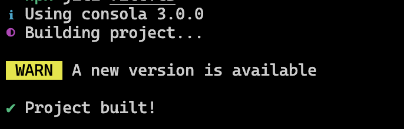
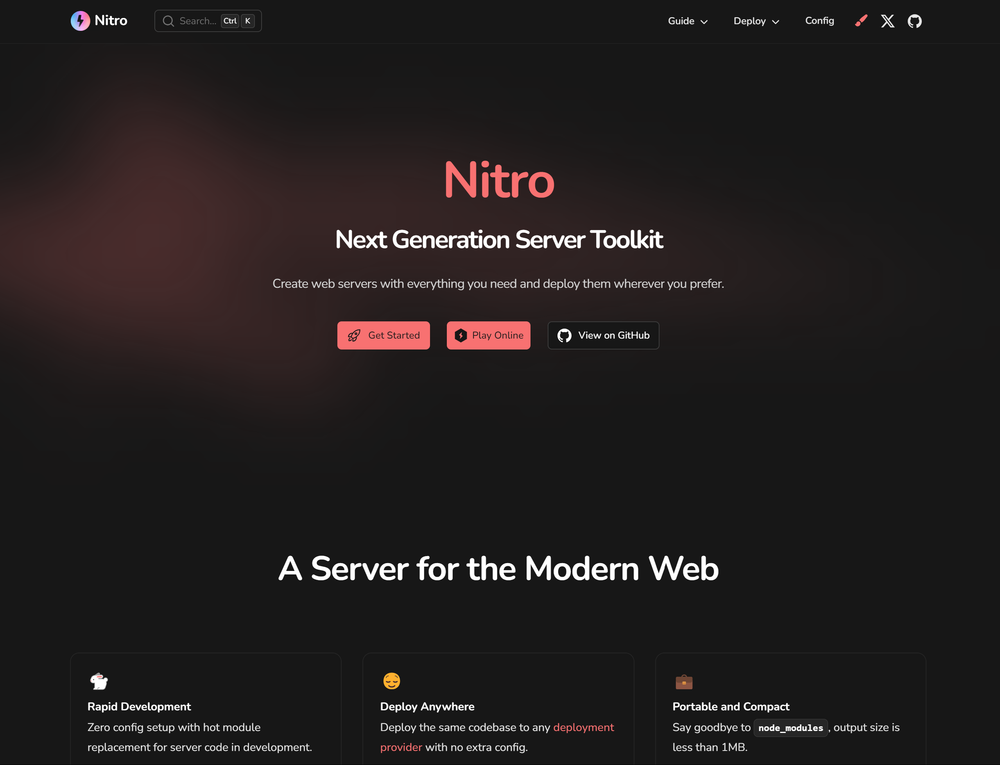

---
htmlAttrs:
  lang: fr
  dir: ltr
layout: cover
highlighter: shiki
css: unocss
colorSchema: dark
transition: fade-out
themeConfig:
  primary: '#fde047'
fonts:
  sans: Nunito
addons:
  - slidev-addon-inalia
inalia:
  bar:
    barWidth: 120
growSeed: 7
title: Découvrons ensemble l'écosystème UnJS
titleTemplate: '%s - Estéban Soubiran'
author: Estéban Soubiran
keywords: unjs,typescript,npm-packages,developer-tooling,edge-computing,cross-runtime
---

<h1 flex="~ col">
  <span>Découvrons <span v-mark.yellow.underline.delay300="{at:1,padding:-8,seed:42}">ensemble</span></span>
  <span flex="~ items-center">l'écosystème UnJS</span>
</h1>

<div abs-br mx-10 my-11 flex="~ col gap-4 items-end" text-left>
  <span>StrasbourgJS</span>
  <div text-xs opacity-75 mt--4>12 avril 2024</div>
</div>

<!--
Bonjour à tous !

J'espère que vous allez bien, que vous êtes en forme parce que les prochaines 20 minutes que nous allons passer ensemble s'annoncent intenses.

Nous allons découvrir ensemble [click] ce qu'est UnJS. On va le faire ensemble pour au moins deux raisons. La première, vous pouvez poser des questions à tout moment. On est en petit comité, pas de pression. La seconde, c'est parce que c'est vous qui allez choisir ce dont on va parler.

Préparez vos téléphones parce qu'il y aura des QR codes à scanner.
 -->

---
layout: intro
name: Myself
class: ml-40
growSeed: 32
---

# Estéban Soubiran

<div class="leading-10 opacity-80">
Développeur web chez <span v-mark.yellow.circle="{at:1,padding:12,seed:4,strokeWidth:2,iterations:1}">Infomaniak</span><br>
Élève-ingénieur en cyber-sécurité<br>
Membre d'<span v-mark.yellow.underline="{at:2,padding:-2,seed:2,strokeWidth:2}">UnJS</span><br>
</div>

<div my-10 w-min flex="~ gap-1" items-center justify-center>
  <div i-ph-link-duotone opacity-50 ma text-xl />
  <div><a href="https://esteban-soubiran.site" target="_blank" class="border-none! font-300">esteban&#8209;soubiran.site</a></div>
  <div i-ph-github-logo-duotone opacity-50 ma text-xl ml4/>
  <div><a href="https://github.com/barbapapazes" target="_blank" class="border-none! font-300">barbapapazes</a></div>
  <div i-simple-icons-x opacity-50 ma text-xl ml4 />
  <div><a href="https://twitter.com/soubiran_" target="_blank" class="border-none! font-300">soubiran_</a></div>
</div>

<!--
Avant de rentrer dans le cœur du sujet, qui suis-je ?

Moi, c'est Estéban.

Actuellement, je suis développeur web chez [click] Infomaniak, un cloud provider éthique et Suisse. En parallèle, je termine mes études d'ingénieur en cyber-sécurité.

Dans mon temps libre, j'adore écrire du code, des articles et participer à des projets open-source. C'est comme ça que depuis 8 mois, je suis devenu membre [click] d'UnJS.

Si vous voulez voir un peu tout ce que je fais, vous pouvez me suivre sur X, c'est là où je suis le plus actif.
-->

---
grow: bottom
---

<Inalia
  question="Connaissez-vous UnJS ?"
  type="single_select"
  chart="donut"
  :data="[
    { label: 'Je l\'utilise régulièrement', count: 5, color: '#4ade80' },
    { label: 'Oui mais de nom', count: 7, color: '#16a34a' },
    { label: 'Non', count: 14, color: '#166534' }
  ]"
/>

<!--
Avant d'aller plus loin, je suis curieux de savoir qui parmi vous connaît l'écosystème.

Pour cela, je vous invite à sortir votre téléphone, scanner le QR code et répondre à la question "Connaissez vous UnJS ?".

Si l'écosystème ne vous parle pas trop, c'est parce qu'il est finalement assez récent. Il a à peine plus de deux ans.

Dans le même temps, il est principalement orienté pour les développeurs de paquets npm. Pour autant, on verra que c'est un vrai couteau suisse et qu'il peut être pratique de l'avoir en tête pour vos prochains projets.

Alors, que nous donne ce graphique ? [improviser].
-->

---
grow: left
name: History
---

<div grid="~ cols-11" h-full gap-3 items-center justify-items-center>
  <v-click at="4">
    <div flex="~ col items-center justify-center" gap-1>
      
      <span class="text-[0.50rem]" op-50 text-center>bundle-runner</span>
    </div>
  <div flex="~ col items-center justify-center" gap-1>
      
      <span class="text-[0.50rem]" op-50 text-center>c12</span>
    </div>
    <div flex="~ col items-center justify-center" gap-1>
        
        <span class="text-[0.50rem]" op-50 text-center>changelogen</span>
    </div>
    <div flex="~ col items-center justify-center" gap-1>
        
        <span class="text-[0.50rem]" op-50 text-center>citty</span>
    </div>
    <div flex="~ col items-center justify-center" gap-1>
        
        <span class="text-[0.50rem]" op-50 text-center>consola</span>
    </div>
    <div flex="~ col items-center justify-center" gap-1>
        
        <span class="text-[0.50rem]" op-50 text-center>cookie-es</span>
    </div>
    <div flex="~ col items-center justify-center" gap-1>
        
        <span class="text-[0.50rem]" op-50 text-center>defu</span>
    </div>
    <div flex="~ col items-center justify-center" gap-1>
        
        <span class="text-[0.50rem]" op-50 text-center>destr</span>
    </div>
    <div flex="~ col items-center justify-center" gap-1>
        
        <span class="text-[0.50rem]" op-50 text-center>fontaine</span>
    </div>
    <div flex="~ col items-center justify-center" gap-1>
        
        <span class="text-[0.50rem]" op-50 text-center>fs-memo</span>
    </div>
    <div flex="~ col items-center justify-center" gap-1>
        
        <span class="text-[0.50rem]" op-50 text-center>get-port-please</span>
    </div>
    <div flex="~ col items-center justify-center" gap-1>
        
        <span class="text-[0.50rem]" op-50 text-center>giget</span>
    </div>
    <div flex="~ col items-center justify-center" gap-1>
        
        <span class="text-[0.50rem]" op-50 text-center>h3</span>
    </div>
    <div flex="~ col items-center justify-center" gap-1>
        
        <span class="text-[0.50rem]" op-50 text-center>hookable</span>
    </div>
    <div flex="~ col items-center justify-center" gap-1>
        
        <span class="text-[0.50rem]" op-50 text-center>httpxy</span>
    </div>
    <div flex="~ col items-center justify-center" gap-1>
        
        <span class="text-[0.50rem]" op-50 text-center>image-meta</span>
    </div>
    <div flex="~ col items-center justify-center" gap-1>
        
        <span class="text-[0.50rem]" op-50 text-center>ipx</span>
    </div>
    <div flex="~ col items-center justify-center" gap-1>
        
        <span class="text-[0.50rem]" op-50 text-center>jimp-compact</span>
    </div>
    <div flex="~ col items-center justify-center" gap-1>
        
        <span class="text-[0.50rem]" op-50 text-center>jiti</span>
    </div>
    <div flex="~ col items-center justify-center" gap-1>
        
        <span class="text-[0.50rem]" op-50 text-center>knitwork</span>
    </div>
    <div flex="~ col items-center justify-center" gap-1>
        
        <span class="text-[0.50rem]" op-50 text-center>listhen</span>
    </div>
    <div flex="~ col items-center justify-center" gap-1>
        
        <span class="text-[0.50rem]" op-50 text-center>magicast</span>
    </div>
    <div flex="~ col items-center justify-center" gap-1>
        
        <span class="text-[0.50rem]" op-50 text-center>mkdist</span>
    </div>
    <div flex="~ col items-center justify-center" gap-1>
        
        <span class="text-[0.50rem]" op-50 text-center>nanotar</span>
    </div>
    <div flex="~ col items-center justify-center" gap-1>
        
        <span class="text-[0.50rem]" op-50 text-center>nitro</span>
    </div>
    <div flex="~ col items-center justify-center" gap-1>
        
        <span class="text-[0.50rem]" op-50 text-center>node-fetch-native</span>
    </div>
    <div flex="~ col items-center justify-center" gap-1>
        
        <span class="text-[0.50rem]" op-50 text-center>nypm</span>
    </div>
    <div flex="~ col items-center justify-center" gap-1>
        
        <span class="text-[0.50rem]" op-50 text-center>ofetch</span>
    </div>
    <div flex="~ col items-center justify-center" gap-1>
        
        <span class="text-[0.50rem]" op-50 text-center>ohash</span>
    </div>
    <div flex="~ col items-center justify-center" gap-1>
        
        <span class="text-[0.50rem]" op-50 text-center>pathe</span>
    </div>
    <div flex="~ col items-center justify-center" gap-1>
        
        <span class="text-[0.50rem]" op-50 text-center>perfect-debounce</span>
    </div>
    <div flex="~ col items-center justify-center" gap-1>
        
        <span class="text-[0.50rem]" op-50 text-center>pkg-types</span>
    </div>
    <div flex="~ col items-center justify-center" gap-1>
        
        <span class="text-[0.50rem]" op-50 text-center>radix3</span>
    </div>
    <div flex="~ col items-center justify-center" gap-1>
        
        <span class="text-[0.50rem]" op-50 text-center>rc9</span>
    </div>
    <div flex="~ col items-center justify-center" gap-1>
        
        <span class="text-[0.50rem]" op-50 text-center>scule</span>
    </div>
    <div flex="~ col items-center justify-center" gap-1>
        
        <span class="text-[0.50rem]" op-50 text-center>theme-colors</span>
    </div>
    <div flex="~ col items-center justify-center" gap-1>
        
        <span class="text-[0.50rem]" op-50 text-center>ufo</span>
    </div>
    <div flex="~ col items-center justify-center" gap-1>
        
        <span class="text-[0.50rem]" op-50 text-center>unbuild</span>
    </div>
    <div flex="~ col items-center justify-center" gap-1>
        
        <span class="text-[0.50rem]" op-50 text-center>uncrypto</span>
    </div>
    <div flex="~ col items-center justify-center" gap-1>
        
        <span class="text-[0.50rem]" op-50 text-center>unctx</span>
    </div>
    <div flex="~ col items-center justify-center" gap-1>
        
        <span class="text-[0.50rem]" op-50 text-center>unenv</span>
    </div>
    <div flex="~ col items-center justify-center" gap-1>
        
        <span class="text-[0.50rem]" op-50 text-center>unhead</span>
    </div>
    <div flex="~ col items-center justify-center" gap-1>
        
        <span class="text-[0.50rem]" op-50 text-center>unimport</span>
    </div>
    <div flex="~ col items-center justify-center" gap-1>
        
        <span class="text-[0.50rem]" op-50 text-center>unpdf</span>
    </div>
    <div flex="~ col items-center justify-center" gap-1>
        
        <span class="text-[0.50rem]" op-50 text-center>unplugin</span>
    </div>
    <div flex="~ col items-center justify-center" gap-1>
        
        <span class="text-[0.50rem]" op-50 text-center>unstorage</span>
    </div>
    <div flex="~ col items-center justify-center" gap-1>
        
        <span class="text-[0.50rem]" op-50 text-center>untun</span>
    </div>
    <div flex="~ col items-center justify-center" gap-1>
        
        <span class="text-[0.50rem]" op-50 text-center>untyped</span>
    </div>
    <div flex="~ col items-center justify-center" gap-1>
        
        <span class="text-[0.50rem]" op-50 text-center>uqr</span>
    </div>
    <div flex="~ col items-center justify-center" gap-1>
        
        <span class="text-[0.50rem]" op-50 text-center>webpackbar</span>
    </div>
    <div flex="~ col items-center justify-center" gap-1>
        
        <span class="text-[0.50rem]" op-50 text-center>automd</span>
    </div>
    <div flex="~ col items-center justify-center" gap-1>
        
        <span class="text-[0.50rem]" op-50 text-center>confbox</span>
    </div>
    <div flex="~ col items-center justify-center" gap-1>
        
        <span class="text-[0.50rem]" op-50 text-center>crossws</span>
    </div>
    <div flex="~ col items-center justify-center" gap-1>
        
        <span class="text-[0.50rem]" op-50 text-center>db0</span>
    </div>
    <div flex="~ col items-center justify-center" gap-1>
        
        <span class="text-[0.50rem]" op-50 text-center>mdbox</span>
    </div>
    <div flex="~ col items-center justify-center" gap-1>
        
        <span class="text-[0.50rem]" op-50 text-center>undocs</span>
    </div>
    <div flex="~ col items-center justify-center" gap-1>
        
        <span class="text-[0.50rem]" op-50 text-center>unwasm</span>
    </div>
  </v-click>

  <div col="start-4 span-5" row="start-2 span-4" relative w-full h-full>
    <div v-click.hide="3" flex="~ items-center justify-center" h-full gap-12>
      <a v-click href="https://github.com/pi0" target="_blank" flex="~ col items-center justify-center" gap-1 class="!border-b-0">
        
        <span text-sm op-60> Pooya Parsa </span>
      </a>
      <a v-click href="https://github.com/nuxt" target="_blank" flex="~ col items-center justify-center" gap-1 class="!border-b-0">
        
        <span text-sm op-60> Nuxt </span>
      </a>
    </div>
    <div v-click="3" absolute top="1/2" left="1/2" translate="x--1/2 y--1/2" flex="~ col justify-center items-center" gap-4>
    
    <div text-lg op-50 flex="~" gap-4>
      <span flex="~ justify-center items-center" gap-2>+50k <span i-ph-star-duotone inline-block></span></span>
      <span flex="~ justify-center items-center" gap-2>+400m <span i-ph-chart-line-up-duotone inline-block></span></span>
      <span flex="~ justify-center items-center" gap-2>+150 <span i-ph-person-duotone inline-block></span></span>
    </div>
    </div>
  </div>
</div>

<!--
[click] Ça, c'est Pooya Parsa. Depuis des années, il développe des outils pour faciliter sa vie de développeur.

En 2020, il devient framework architect de [click] Nuxt3 et avec cette nouvelle version, il naît une volonté de faire de Nuxt un framework compatible avec l'edge.

Pour cela, il est décidé d'extraire des parties du code de Nuxt pour les rendre agnostiques du runtime et du provider. Cette pratique permet en faciliter la maintenance et poser des bases solides et unifiées pour les autres auteurs de paquets qui souhaiterait se lancer dans l'aventure de l'edge. Les utilitaires sont fait et pensés pour l'edge même si vous pouvez les utiliser dans n'import quel projet.

C'est ainsi [click] qu'UnJS est né en 2022, d'une fusion des outils de Pooya et de certaines parties de Nuxt. Aujourd'hui, UnJS est une organisation à part entière sur GitHub et qui est utilisé par beaucoup de gros projets.

Depuis 2022, l'écosystème a bien évolué et compte désormais [click] 63 paquets, plus de 50 000 étoiles, 400 millions de téléchargements par mois et 150 contributeurs.
-->

---
grow: bottom
name: Creating Package
---

<Inalia
  question="Avez-vous déjà construit des paquets pour npm ?"
  type="single_select"
  chart="bar"
  :data="[
    { label: 'Régulièrement', count: 2, color: '#3730a3' },
    { label: 'De temps en temps', count: 2, color: '#4f46e5' },
    { label: 'Rarement', count: 10, color: '#818cf8' },
    { label: 'Jamais', count: 7, color: '#c7d2fe' }
  ]"
/>

<!--
Comme on vient de le voir, UnJS est plutôt orienté pour les développeurs de paquets npm. Du coup, qui parmi-vous a déjà publié des paquets sur npm ?

Pour cela, je vous invite à sortir votre téléphone, scanner le QR code et répondre à la question.

Si vous avez déjà construit des paquets pour npm, vous avez pu rencontrer différentes difficultés comme la phase de build, la génération des versions et du changelog, la gestion des configurations et bien d'autres...

Si au contraire, vous n'avez jamais construit de paquets pour npm ou que vous vous posez pleins de questions sur les manières de faire ou les problématiques rencontrées, n'hésitez pas à poser un tas de questions.

Alors, qu'est-ce que nous donne ce graphique ? [improviser]
 -->

---
grow: bottom
class: compose-the-talk
name: Compose the Talk
inalia:
  bar:
    height: 280
    barWidth: 20
---

<Inalia
  question="Quels paquets d'UnJS aimeriez-vous qu'on aborde ?"
  type="single_select"
  chart="bar"
  :data="[
    {
      color: '#b91c1c',
      label: 'unstorage',
      count: 5
    },
    {
      color: '#ba531c',
      label: 'unplugin',
      count: 5
    },
    {
      color: '#ba8b1c',
      label: 'citty',
      count: 1
    },
    {
      color: '#b2ba1c',
      label: 'c12',
      count: 2
    },
    {
      color: '#7bba1c',
      label: 'unimport',
      count: 4
    },
    {
      color: '#43ba1c',
      label: 'magicast',
      count: 2
    },
    {
      color: '#1cba2c',
      label: 'scule',
      count: 0
    },
    {
      color: '#1cba63',
      label: 'consola',
      count: 1
    },
    {
      color: '#1cba9b',
      label: 'ofetch',
      count: 2
    },
    {
      color: '#1ca3ba',
      label: 'unbuild',
      count: 3
    },
    {
      color: '#1c6bba',
      label: 'nypm',
      count: 4
    },
    {
      color: '#1c34ba',
      label: 'changelogen',
      count: 4
    },
    {
      color: '#3c1cba',
      label: 'defu',
      count: 1
    },
    {
      color: '#731cba',
      label: 'h3',
      count: 6
    },
    {
      color: '#ab1cba',
      label: 'nitro',
      count: 10
    },
    {
      color: '#ba1c93',
      label: 'std-env',
      count: 2
    },
    {
      color: '#ba1c5b',
      label: 'magic-regexp',
      count: 4
    }
  ]"
/>

<!--
On a vu l'historique d'UnJS, sa cible et ce qu'il propose dans les très grandes lignes. Il serait peut-être temps de se plonger un peu plus dans les paquets.

Le truc, c'est qu'il y a peut-être des paquets d'UnJS que vous avez vu passer en lisant du code, ou que vous avez déjà entendu le nom sans savoir qu'il faisait parti d'UnJS, mais que vous ne savez pas trop ce qu'ils font, le problème qu'ils essaient de résoudre.

Ce que je vous propose ce soir, c'est qu'on compose le talk ensemble. Vous pouvez scanner le QR code pour choisir les paquets que nous vous aimeriez qu'on aborde.

C'est important de rappeler que UnJS compte plus de 63 paquets et que évidemment, on ne pourra pas tous les voir aujourd'hui, d'ailleurs, je vous ai déjà une sélection. L'idée, c'est de répondre à un maximum de vos interrogations, vous donner la vision la plus large possible et simplement vous donner envie de vous plonger dans l'écosystème ! Si vous avez des questions, à tout moment, ne pas hésiter.
-->

---
layout: two-cols
name: unstorage
---

<PackageTitle name="unstorage" />

Interface clé-valeur universelle.

- Agnostique du _runtime_
- 20+ pilotes, support de plusieurs points
- Support les binaires

::right::

```ts
import { createStorage } from 'unstorage'
import fsDriver from 'unstorage/drivers/fs'

// Default to in-memory storage
const storage = createStorage({})

storage.mount('/out', fsDriver({ base: './out' }))

//  Writes to ./out/test file
await storage.setItem('/out/test', 'works')

// Adds value to in-memory storage
await storage.setItem('/foo', 'bar')
```

<!--
Deux points importants pour bien comprendre unstorage.

Le premier, entre le développement et la production, le stockage clé-valeur n'est pas nécessairement le même. Un FS peut suffire sur votre machine mais utiliser le service de votre cloud provider peut-être plus intéressant.

Le second, c'est qu'il n'est pas rare d'avoir plusieurs points de stockage avec des services différents derrières.

Point bonus, c'est un outil pour l'edge.

Unstorage vient gommer tout cela en créant une interface unique. Vous écrivez le code une fois et ensuite, via de la configuration, vous pouvez changer simplement et sans toucher votre code de pilotes.

Ce fonctionnement est d'autant plus pratique pour les auteurs de paquets npm qui n'ont pas à choisir pour vous le pilote à utiliser. Vous pouvez choisir celui qui vous convient le mieux.
-->

---
name: unplugin
class: flex flex-col items-start justify-center
---

<PackageTitle name="unplugin" />

Système unifié de plugins pour Vite, Rollup, Webpack, esbuild, rolldown, etc.

<div abs-bl p-24 right-0  flex="~ justify-between items-center">
  <span class="i-logos-vitejs" inline-block h-16 w-16></span>
  <span class="i-logos-rollupjs" inline-block h-16 w-16></span>
  <span class="i-logos-webpack" inline-block h-16 w-16></span>
  <span class="i-logos-esbuild" inline-block h-16 w-16></span>
</div>

<!--
Vite s'impose dans le développement web front-end. Pour autant, il existe encore des usages ou des impossibilités de migrer qui font que webpack est encore utilisé. Dans le même temps, Vite, n'est pas adapté et esbuild et rollup, plus bas niveau, sont plus pertinent.

Le problème, c'est que tous ces outils ont une interface différentes pour les étendre, pour créer des plugins. Unplugin vient unifier tout cela en créant une interface commune. Vous écrivez un plugin avec unplugin et il est compatible avec tous ces outils. Pour le développeur, c'est un gain de temps, d'énergie et de maintenance puisqu'il n'a plus que un repo et une code base. Dans le même temps, il peut toucher beaucoup plus de monde avec un unique paquet npm et unifier les communautés autour d'un même paquet.

// mettre les logos en couleurs et plus petits
-->

---
layout: two-cols
name: citty
---

<PackageTitle name="citty" />

Élégant outil pour CLI.

- Sous-commandes imbriquées
- Commandes _lazy_ et _async_
- Usage et aide auto-générées

::right::

```ts
import { defineCommand, runMain } from 'citty'

const main = defineCommand({
  meta: {
    name: 'hello',
    version: '1.0.0',
    description: 'My Awesome CLI App',
  },
  args: {
    name: {
      type: 'positional',
      description: 'Your name',
      required: true,
    },
    friendly: {
      type: 'boolean',
      description: 'Use friendly greeting',
    },
  },
  setup() {
    console.log('Setting up...')
  },
  cleanup() {
    console.log('Cleaning up...')
  },
  run({ args }) {
    console.log(`${args.friendly ? 'Hi' : 'Greetings'} ${args.name}!`)
  },
})

runMain(main)
```

<!--
Citty, c'est un outil pour construire des CLI, des _commande line interface_.

Dans le processus de développer un paquet npm, il n'est pas rare de vouloir fournir plusieurs interfaces pour le développeur. La première, c'est du code, c'est le paquet en lui même. La seconde peut être via un CLI pour lancer un server, générer un fichier ou autre.

Citty vous permet de faire des CLI avec des features très intéressante.

Dans l'example, on voit qu'on défini les arguments sous la forme d'un objet. Cette objet, il est récupéré par TypeScript et permet de typer l'objet `args`. Du coup, `friendly` est typé comme un boolean dans ce code.

Au sein d'un commande, on peut définir des sous-commandes et comme on le fait avec la même fonction, il n'y a pas de profondeur limite. Ces commandes peuvent être lazy loadées donc chargées uniquement lorsqu'elles sont utilisées ce qui permet de faire grossir son CLI sans avoir peur de le ralentir.
-->

---
layout: two-cols
name: c12
---

<PackageTitle name="c12" />

Chargeur de configuration intelligent.

- Charge tous types de fichiers
- Supporte les `.rc` et `.env`
- Configuration spécifique à l'environnement

::right::

```ts
import { loadConfig } from 'c12'

const config = loadConfig({
  name: 'strasbourg',
  dotenv: true,
  defaults: {
    plugins: ['build-in'],
    outDir: 'dist',
    debug: true
  }
})
```

```json
// strasbourg.config.json
{
  "$production": {
    "debug": false
  }
}
```

<!--
Quand on crée un outil comme un CLI ou un framework, on veut que le développeur puisse le configurer pour l'adapter à son utilisation. C12 vous permet cela simplement en cherchant, chargeant et fusionant un ensemble de fichiers.

Dans cette example, on lui demande de charger la configuration `strasbourg`. Il va chercher les fichiers `strasbourg.config.{js,ts,json,yml}`. Il va aussi regarder dans le `package.json` une clée `strasbourg` et fusionner tout cela avec defu [defu doit être le prochain package].

Il est même en mesure d'aller chercher des fichiers `.rc` à la racine de la machine pour permettre de partager une configuration entre plusieurs projets. C'est utilisé pour désactiver globalement des options des outils par example. Vous dites non une fois et ensuite, tous les projets savent que c'est non. Mais si dans un projet spécifique vous dites oui, alors ça va sur-écrire la valeur globale.

Il support aussi les configuration spécifique à l'environnement. Dans ce cas [example], `debug` n'est `true` que quand la variable d'environnement `NODE_ENV` est égale à `production`.
-->

---
layout: two-cols
name: unimport
---

<PackageTitle name="unimport" />

Utilitaires unifiés pour l'importation automatique des API dans les modules.

::right::

```ts
export const counter = ref(0)
```

<!--
Unimport est clivant, certains adorent, d'autres détestent. Ce qui est certain, c'est que si vous aimez écrire et lire les import du haut des fichiers, il y a peu de chances que vous aimiez.

L'idée est de réduire la friction, d'accéder rapidement au code qui compte et se passer des dizaines de lignes d'import. Ça fonctionne grâce à TypeScript qui lit des types générés par le plugin. Unimport est un plugin unplugin qui viendra modifier les fichiers pour ajouter les imports nécessaires ce qui permet de profiter du tree-shaking.

Le problème c'est que vous devez avoir tout votre projet en tête pour comprendre les références implicites et que pour une personne arrivant sur le projet, ça peut être complexe de s'y retrouver.
-->

---
layout: two-cols
name: magicast
---

<PackageTitle name="magicast" />

Modifie programmatiquement du JavaScript ou du TypeScript.

- Manipule le code source comme un JSON
- Conserve le formatage

::right::

```ts
export default {
  plugins: ['a'],
}
```

```ts
import { loadFile, writeFile } from 'magicast'

const mod = await loadFile('config.js')

mod.exports.default.plugins.push('b')

await writeFile(mod, 'config.js')
```

<!--
Celui là, il n'a que une utilité, modifier du code source JavaScript ou TypeScript programmatiquement. Mais qu'est ce que ça veut dire ?

Prenons l'example d'un CLI avec une commande `add` qui va installer une dépendance puis l'ajouter dans un tableau qui contiendrait tous les plugins de l'application. En terme de DX, c'est super. Mais à développer, c'est un peu plus complexe parce que vous allez devoir passer par une regexp ou de la manipulation de chaînes de caractères ce qui peut devenir délicat surtout si votre fichier évolue.

Avec magicast, vous allez pouvoir modifier un fichier comme vous modifier un JSON. Vous le charger puis vous pouvez le manipuler super simplement, dans notre cas, on ajoute un élément à un tableau, et on sauvegarde le fichier. Notre fichier `config.js` aura dans son tableau `a, b`. Beaucoup plus simple qu'une regexp et stable dans le temps.
-->

---
layout: two-cols
name: scule
---

<PackageTitle name="scule" />

Utilitaire pour la casse des chaînes de caractères.

::right::

```ts
pascalCase('foo-bar_baz')
// FooBarBaz
```

```ts
upperFirst('hello world!')
// Hello world!
```

```ts
trainCase('FooBARb')
// Foo-Ba-Rb
```

<!--
La manipulation de chaîne de caractères, c'est tout le temps que ça arrive, d'une variable à un nom de fichier, un header HTTP ou simplement une normalisation, et clairement pas que durant le développement de paquets npm.

Scule, c'est 10 fonctions utilitaires pour transformer une chaîne de caractères en un format bien précis, ni plus ni moins.

Simple à utiliser, simple à prendre en main mais toujours pratique. Je vous le conseil pour votre boite à outils.
-->

---
layout: two-cols
name: consola
---

<PackageTitle name="consola" />

Élégant  _wrapper_ de `Console`.

- Rapporteurs personnalisées
- Support les tags, pause/resume
- Prévention du spam

::right::

```ts
consola.info('Using consola 3.0.0')
consola.start('Building project...')
consola.warn('A new version is available')
consola.success('Project built!')
```



<!--
Dans sa manière la plus simple, consola, c'est exactement comme le `Console` qu'on connait tous sauf que c'est plus joli dans la console ou le navigateur.

Il devient intéressant parce que vous pouvez créer des instances personnalisées de Consola. C'est à dire que vous pouvez le paramétrer, comme vous le souhaitez pour qu'il affiche des informations spécifiques, avec une rapporteur personnalisé, un autre niveau de logs et encore beaucoup d'autres options.

Mais c'est vraiment très avancé comme usage. Pour la plupart des cas, vous allez simplement l'utiliser comme un `Console` amélioré.
-->

---
layout: two-cols
name: ofetch
---

<PackageTitle name="ofetch" />

Une meilleure API de `fetch` qui fonctionne avec Node, le navigateur et les workers.

- Création d'une instance pré-configurable
- Simple et Fonctionnel
- Utilisable avec tous les runtimes

::right::

```ts
import { ofetch } from 'ofetch'

const api = ofetch.create({
  baseURL: 'https://api.example.com',
  async onRequestError({ request, options, error }) {
    // Use interceptors to handle errors
  },
})
```

```ts
const data = await api('/api/posts')
/**
 * {
 *  data: [
 *    { id: 1, title: 'Hello' },
 *    { id: 2, title: 'World' },
 *  ],
 * }
 */
```

<!--
Il devrait vous plaire celui-là.

`ofetch`, c'est similaire au `fetch` du navigateur, en mieux et qui fonctionne dans Node comme dans un Worker. Jusqu'à récemment, `fetch` n'existait pas dans Node et en fonction de votre environnement, votre JavaScript n'avait pas les même capacités et vous deviez installer des paquets supplémentaires et différents.

Il a quelques fonctionnalités en plus comme la possibilité de faire ses instances, de se brancher à des hooks, pratique pour demander un nouvel access token ou loger les erreurs, et désérialise automatiquement la réponse, fini l'appel du `.json`.

Utiliser `ofetch` permet d'avoir une API consistante entre le serveur et le client. C'est un point  important pour un framework frontend qui fait du SSR puisque le call doit pouvoir se faire tant depuis le serveur que depuis le client.
-->

---
layout: two-cols
name: unbuild
---

<PackageTitle name="unbuild" />

Un système de _build_ JavaScript unifié.

- Inférence du `package.json`
- Génération de CJS, ESM et Types
- _Bundleless build_
- _Passive watcher_

::right::

```json
{
  "type": "module",
  "exports": {
    ".": {
      "import": "./dist/index.mjs",
      "require": "./dist/index.cjs"
    }
  },
  "main": "./dist/index.cjs",
  "types": "./dist/index.d.ts",
  "files": ["dist"]
}
```

```bash
npx unbuild
```

<!--
Celui-là, c'est peut-être mon préféré.

Je me souviens quand j'ai commencé à vouloir publier mes premiers paquets npm, mettre en place les outils nécessaires pour construire le paquet, c'était l'enfer, et une fois que je pensais avoir réussi, je me suis rendu compte que j'allais maintenant devoir le faire avec TypeScript.

Avec ce unbuild, fini les maux de tête. Il suffit d'écrire correctement son `package.json` copié depuis le readme, lançer `npx unbuild` et le tour est joué.

Dessous, c'est du `rollup` et donc ça reste customisable.

// mettre après nypm pour l'avoir avant changelogen et faire une liaison plus fluide
-->

---
layout: two-cols
name: nypm
---

<PackageTitle name="nypm" />

Le gestionnaire de paquets unifié<br /> pour Node.js et Bun.

- Détection automatique
- Interface pour interagir programmatiquement

::right::

<span op50> CLI </span>

```bash
# ✨ Auto-detect
npx nypm i my-super-dep
```

<span op50> Programmatiquement </span>

```ts
import { addDependency } from 'nypm'
```

<!--
npm, yarn, yarn version 2, pnpm et maintenant bun, ça commence à faire beaucoup de package manager. Et ça devient d'autant plus complexe quand on passe notre journée à sauter de projet en projet, de reproduction en reproduction et qu'il faut à chaque fois trouver le bon pour installer les dépendances.

L'idée de nypm, c'est de ne plus avoir à réfléchir quand vous _cloner_ un projet ou que vous faites un _pull_ parce qu'il est une couche au dessus. En fonction de différents indices comme votre _lock file_, `nypm` va choisir le bon gestionnaire de paquets pour executer la bonne commande. Et ça, c'est génial, une commande pour les gouverner toutes.

Dans le même temps, son architecture modulaire fait qu'il peut être utilisé programmatiquement, dans un CLI par example.

Cette philosophie, d'exposer son paquet les fonctions utilitaires du projet, c'est vraiment l'esprit d'UnJS, pour vous permettre de construire par dessus avec des bases solides et valables quelque soit l'environnement.
-->

---
layout: two-cols
name: changelogen
---

<PackageTitle name="changelogen" />

Magnifique changelog grâce aux commits conventionnels.

- Génération du changelog automatisée
- Saut de version automatique avec semver
- Fonctions exposées pour une utilisation dans d'autres scripts

::right::

<span op50> Les commits </span>

```sh
feat: add new feature
fix: fix a bug
docs: update documentation
```

<span op50> La commande </span>

```bash
npx changelogen@latest --release
```

<span op50> Le résultat </span>

```txt
🚀 Enhancements
add new feature (#134)
🩹 Fixes
fix a bug (#133)
📖 Docs
update documentation (#135)
❤️ Contributors
Barbapapazes
```

<!--
Faire une _release_, c'est un processus plus compliqué qu'il en a l'air. Il faut penser à choisir et change la version, faire le _changelog_, faire le commit et faire le tag avec la bonne version. Il est facile de se tromper, encore plus quand on joue avec des _prerelease_ et tout ça sur différents projets, en même temps.

Changelogen se base sur vos commits pour faire tout ça. Rien à penser et en plus, on est sûr que ce soit bon à tous les coups.

Comme nypm, il expose toute ses fonctions pour être étendu dans un script pour son projet ou un autre paquet, comme changelogithub.
-->

---
layout: two-cols
name: defu
---

<PackageTitle name="defu" />

Attribuer des propriétés par défaut de manière récursive.

- Léger et rapide
- Fusionner avec des fonctions, des tableaux et personnalisable
- Types inclus

::right::

```ts
defu({
  vite: {
    plugins: ['custom'],
    ssr: true
  }
}, {
  vite: {
    plugins: ['build-in'],
    outDir: 'dist',
    ssr: false
  }
})
```

```txt
{
  vite: {
    plugins: [ 'custom', 'build-in' ],
    outDir: 'dist',
    ssr: true
  }
}
```

<!--
Oooh, defu. Simple mais pratique et depuis que je l'ai essayé, je l'ai adopté partout.

Quand on crée des outils, que ce soit un framework ou un petit utilitaire, c'est nécessaire de laisser le développeur les configurer en passant des options.

Le plus souvent, on accepte un object et puis on merge l'un dans l'autre. Mais quand l'objet est sur plusieurs niveaux ou qu'il y a des tableaux, comment on gère ?

À la main ou récursivement, sur tous les objets et les sous objets mais c'est toujours la galère.

Defu vient régler exactement ce problème. Sur ce petit example, on voit que nos 2 tableaux ne font plus que un et que nos 2 objets ont été unifié.
-->

---
layout: two-cols
name: h3
---

<PackageTitle name="h3" />

- Léger et _tree-shakeable_
- Composable et _lazy loaded_
- Agnostique du _runtime_

::right::

```ts
export default defineEventHandler(async (event) => {
  assertMethod(event, 'POST')

  const body = await readBody(event)
  const query = getQuery(event)

  if (!body)
    throw createError({ statusCode: 422 })

  if (query)
    return query

  return sendRedirect(event, '/success')
})
```

<!--
H3, c'est comme Express mais entièrement tree shakable. Dans votre bundle final, vous n'aurez que ce que vous utilisez.

L'API est pensée pour être hyper intuitive et facile avec des composables. Par example, vous pouvez vous assurer de la méthode de la requête, récupérer le body ou la query avec de simple composables, throw une erreur ou retourner du json !

Cette approche, dans la conception de h3 permet d'avoir un temps de démarrage, le fameux cold start dans l'edge, sous la barre des 2ms. C'est vraiment rapide.
-->

---
layout: two-cols
name: nitro
---

<PackageTitle name="nitro" />

- Portable et compacts
- Personnalisable et extensible
- KV (unstorage), DB (db0), WebSocket (crossws) intégrés

::right::



<div text-center mt-2>
  <a href="https://nitro.unjs.io" target="_blank" class="border-none! op50">nitro.unjs.io</a>
</div>

<!--
H3, c'est sympa mais ça reste bas niveau et quand on veut faire des choses sérieuses, Nitro devient le compagnon idéal.

Nitro, c'est à la fois un framework pour construire des un backend dans l'edge et un toolkit pour le prochain framework full-stack.

Je pourrais en parler 1h, je n'ai pas vraiment le temps et je vous invite sincèrement à le découvrir et l'explorer. Il repose sur tout ce que j'ai pu vous présenter jusque là.

Un petit fait quand même, il a été optimisé pour l'edge à tel point qu'en production, il tient dans moins de 1mb, node_modules inclus.

Par example, c'est lui qui propulse Nuxt ou Analog.
-->

---
name: std-env
class: flex flex-col items-start justify-center
---

<PackageTitle name="std-env" />

Utilitaires JavaScript indépendants du runtime.

- Détection du _provider_ et du _runtime_
- CI / TTY / OS / Développement / Version

<div abs-bl p-8 right-0  flex="~ justify-between items-center">
  <span class="i-devicon-plain-amazonwebservices-wordmark?mask" inline-block h-14 w-14></span>
  <span class="i-devicon-plain-azure-wordmark?mask" inline-block h-24 w-24></span>
  <span class="i-devicon-plain-cloudflare-wordmark?mask" inline-block h-24 w-24></span>
  <span class="i-devicon-plain-netlify-wordmark?mask" inline-block h-24 w-24></span>
  <span class="i-devicon-vercel-wordmark?mask" inline-block h-24 w-24></span>
  <span class="i-devicon-plain-circleci-wordmark?mask" inline-block h-14 w-14></span>
  <span class="i-devicon-plain-gitlab-wordmark?mask" inline-block h-12 w-12></span>
</div>

<!--
AWS, Azure, Cloudflare, Netlify ou Vercel, vous savez ce qu'ils n'ont pas en commun ? La manière de les configurer pour déployer votre application.

Pour permettre le déploiement sans configuration de Nitro, std-env est en mesure de détecter le provider et le runtime grâce à plusieurs indices pour mettre à jour la configuration dynamiquement. Le développeur n'a rien à faire ni à réfléchir.

Il permet d'améliorer la DX de ses outils en adaptant le comportement à l'environnement.
-->

---
layout: two-cols
name: magic-regexp
---

<PackageTitle name="magic-regexp" />

Une alternative compilée, sûre et lisible à RegExp.

- Syntax naturelle et compréhensible
- Groupes capturés typés automatiquement
- Compilation en RegExp native

::right::

```ts
// Simple Semver Matcher
createRegExp(
  oneOrMore(digit).groupedAs('major'),
  '.',
  oneOrMore(digit).groupedAs('minor'),
  maybe('.', oneOrMore(char).groupedAs('patch'))
)
```

<!--
Les regexp, ça vous parle ? Ça peut vite devenir technique et difficile à maintenir.

Si on avait la possibilité de les écrire avec du langage naturel, des mots qui font sens, on prendrait peut être un peu plus de plaisir. Ouais, je suis bien d'accord avec ça aussi.

Là, sur l'example, tout le monde peut me dire ce que fait la regexp ? Des mots qui font sens, ensemble.

Beh, c'est ça magic-regexp, tout simplement. C'est des mots qui font sens ensemble.

En cadeau, le type de la fonction `createRegExp`vous montre la regexp générée et les groupes capturés sont typés. Magique !

Attention quand même, ce n'est pas une raison pour mettre des regexp partout !
-->

---
name: Et tellement plus
---

<SoMuchMore />

<div abs-br pr-10 pb-10 flex="~ col gap-1" items-start>
  <div flex="~ gap-1" items-center>
    <div i-simple-icons-x opacity-50 text-xl/>
    <div><a href="https://twitter.com/soubiran_" target="_blank" class="border-none! font-300">soubiran_</a></div>
    </div>
  <div flex="~ gap-1" items-center>
    <div i-ph-github-logo-duotone opacity-50 text-xl />
   <div><a href="https://github.com/barbapapazes" target="_blank" class="border-none! font-300">barbapapazes</a></div>
  </div>
  <div flex="~ gap-1" items-center>
    <div i-ph-link-duotone opacity-50 text-xl />
    <div><a href="https://esteban-soubiran.site" target="_blank" class="border-none! font-300">esteban&#8209;soubiran.site</a></div>
  </div>
</div>

<!--
Et voilà ! Ce que vous venez de voir n'est qu'un aperçu de tout ce que propose UnJS et de tout ce qu'il est possible de faire avec.

Par example, il y a unplugin pour développer des plugins pour Vite, Webpack, Rollup, Rspack, Rolldown avec une API unique, il y a citty pour créer des CLI simplement, c12 pour la gestion facilité de la configuration, uqr pour faire des QR code comme celui-ci et encore beaucoup beaucoup d'autres.

J'espère vous avoir donné envie d'explorer l'écosystème avec cette courte introduction.

Dites moi quels sont vos paquets préféré en flashant le QR code et si vous avez des questions, c'est le moment !

Merci à tous.
-->
